# PitchYourOwner AWS 整合決策與問題報告

更新日期：2026-09-04（Asia/Taipei）

目前狀態：Batch 1–4 與 AWS 實作已完成；所有產品衝突已依較晚回覆收斂，線上端到端驗證通過

目標：記錄 Hackathon 第一版的唯一有效產品／技術決策，並追蹤隔離式 PitchYourOwner AWS stack 的實作與驗證。

> **閱讀規則：**第 1、5、10、11、13、16、18、19、20 節及 Batch 4 決策為目前有效答案。第 8、9、15 節保留的是當時提問選項與探索紀錄，不是仍待選的需求；若文字衝突，一律採日期較晚的已確認答案。

## 1. 本輪任務與已確認需求

Host Owner 要求：

1. 刪除先前 DigitalOcean 測試機。
2. 拉取 `https://github.com/stantheman070911/futuremode`，理解最新產品與互動設計。
3. 研究 `/Users/wanghsuanchung/OysterunAgents/VibeMate` 的既有 AWS stack，判斷可重用與不相容部分。
4. Hackathon 第一版以手機可完成的網站流程為主：
   - 使用者在網站註冊／登入；
   - 網站提供可貼到 ChatGPT 的 prompt；
   - ChatGPT 根據實際可存取的使用者歷史產生 profile；
   - 使用者把回答貼回網站；
   - 網站先顯示可編輯欄位，再進入獨立唯讀審核；使用者確認後才發布 profile。
5. 電腦端只提供普通 HTTP draft-upload API；WebMCP 與 Remote MCP 已排除於 Hackathon 範圍。
6. 以批次提問確認需求；每一批回答後更新本報告，最後形成完整實作計畫。

既有且仍有效的產品決策：

- 產品名稱為 **PitchYourOwner**；每個使用者是 agent 的 owner，由 agent 替 owner 做 pitch。
- 目標是找朋友，而非招聘、履歷、約會或追蹤者網路。
- 配對訊號是共同興趣、相同動機、正在解決的相同問題、反覆討論的相同主題。
- 不限工程師；攝影師、舞者及其他專業或興趣領域都應可參與。
- 不做多輪問答。Paste-back 路徑有兩個明確但目的不同的關卡：ChatGPT 端只針對實際偵測到的 security／privacy 問題提供選項並取得安全確認；網站端 Review & Publish 確認匯入結果並授權發布。
- 網站流程細化為：貼入 JSON → 以欄位標題、label 與 textarea 呈現可編輯內容 → Continue/Enter → 唯讀最終 Review → Confirm & upload。若不確認，返回欄位編輯頁。
- 網站不做任何敏感資料辨識、標記、過濾或移除。產品只負責提供 prompt，要求 ChatGPT 在其頁面辨識並標示敏感內容給使用者確認；確認後傳回網站的 profile 不再包含敏感資料處理資訊。
- 不以冷啟動作為本次 Hackathon 的主要問題。
- 可有強配對通知或平台邀請，但禁止無限滑動、人氣分數或純 engagement loop。
- 全部專案問答以繁體中文回覆。

## 2. 已完成的環境操作

### 2.1 DigitalOcean

- 已永久刪除 droplet：`oysterun-test-host-20260903-111112`
- Droplet ID：`597473165`
- 舊 IP：`165.245.190.1`
- 刪除後再次查詢，符合名稱的 active host 數量為 0。
- 刪除權限已自動恢復為停用；這台 VM 無法直接復原。

### 2.2 FutureMode GitHub

- 本機 clone：`/Users/wanghsuanchung/OysterunAgents/FutureMore/futuremode-repo`
- Remote：`https://github.com/stantheman070911/futuremode.git`
- 已執行 fast-forward pull。
- 目前 branch：`main`
- 目前 commit：`cdf111bbcb5e527b6d0bf83fa452b8d0dc339307`
- 工作樹：已包含本次獲授權的規格與實作變更；不得再視為乾淨 clone。

最新 commit 將 repo 收斂為：

- `docs/product-design.md`：產品設計唯一標準來源。
- `docs/get_info_prompt_ch.md`、`docs/get_info_prompt_en.md`：交給 AI 的 profile extraction prompt。
- `design/prototype.html`：15 個手機畫面與 1 個互動流程的探索型 prototype。
- `README.md`：歷史背景，不是目前產品規格。

### 2.3 VibeMate AWS 與程式碼

本機 repo：`/Users/wanghsuanchung/OysterunAgents/VibeMate`

- Branch：`experiment/traceable-topic-discovery-v2`
- Commit：`c5f8755…`
- Remote `main`：`28ac53b…`
- 工作樹非常髒：約 396 個 staged files，另有 unstaged／untracked 內容。
- AWS cloud 程式與大量文件主要存在於這份未整理的本機工作樹，並未可靠地存在於目前 remote `main`。
- 本輪只讀檢查，未修改 VibeMate repo。

既有 AWS stack：

- Stack：`VibeMate-dev`
- Region：`ap-southeast-1`
- 狀態：`UPDATE_COMPLETE`
- 網站：`https://vibesafari.oysterun.com`
- API：`https://upe4flq7h1.execute-api.ap-southeast-1.amazonaws.com`
- DynamoDB table：`vibemate-dev-profile-store`
- 網站首頁與 `/manage` 皆回傳 HTTP 200；API root 回傳預期的 HTTP 404。
- Cloud 套件測試：31/31 通過。
- TypeScript build：通過。

現有架構包含：

- S3 私有靜態站台 + CloudFront/OAC + ACM。
- API Gateway HTTP API + Node.js Lambda。
- DynamoDB 單表、PITR、TTL、刪除保護與 retain policy。
- Email OTP 驗證、30 天 opaque access token、Resend 寄信。
- Bedrock Cohere embedding、向量搜尋、Nova match judge。
- Profile 發布／讀取／刪除、公開頁、OG image。
- Matching、邀請 email outbox、SQS/DLQ、告警、預算保護與支援表單。

重要基礎設施風險：目前部署用 AWS profile 對應 root identity。新建 stack 前應決定是先改用 least-privilege deploy role，或為 Hackathon 接受暫時風險並立即安排後續收斂。

## 3. 最新設計所描述的核心體驗

依 Host Owner 較晚回覆完成衝突收斂後，目前 canonical flow 是：

1. 理解 PitchYourOwner 的承諾。
2. 選擇 ChatGPT 或 Claude。
3. 以單一操作將完整 handoff prompt 帶入選定 AI 並開啟；ChatGPT 使用預填 deep link 並同步嘗試 clipboard fallback，不再分成 Copy 與 Open 兩個必要步驟。
4. AI 產生完整 owner pitch，並在 AI 頁完成敏感資料處理與一次整合式內容確認。
5. AI 回傳最終 structured JSON。
6. 使用者回到網站貼上 JSON；網站只做 schema 驗證並渲染可編輯欄位。
7. 使用者進入獨立唯讀發布審核，可返回編輯或選擇 Confirm & upload。
8. 發布後立即啟動配對。
9. 系統以三個問題與 evidence labels 顯示可解釋的 match。
10. 使用者發送邀請；雙方接受後才揭露聯繫方式。

登入後的主要區域為：`Matches`、`Invitations`、`My Pitch`、`Settings`。

Profile 契約為七個核心欄位，加上 owner-review-only 的 `confidence` metadata：

1. `summary`
2. `interests`
3. `motivations`
4. `active_problems`
5. `recurring_topics`
6. `friend_intent`
7. `history_scope`
8. `confidence`（只對 owner 顯示，不公開、不參與 matching，不算第八個公開維度）

Payload 不包含敏感資料刪除／概括狀態，也不包含 privacy ledger。

## 4. 可重用與應替換的部分

| VibeMate 能力 | 建議 | 原因 |
|---|---|---|
| CloudFront + S3 + API Gateway + Lambda + DynamoDB | 重用架構模式 | serverless、已有部署與測試證據，適合短期 Hackathon |
| Email OTP 與 hashed access token | 重用並調整 UI | 已可運作，但要接到新 onboarding |
| Bedrock embedding 與 matching pipeline | 選擇性重用 | 技術已存在，但輸入 schema 與產品目標要改 |
| 立即／手動 matching | 新增 | 現有 weekly schedule 已停用，不適合現場 demo |
| SQS email outbox、告警、budget | 依 MVP 範圍保留 | 有營運價值，但不應阻塞核心體驗 |
| 公開 profile 與 OG image | 暫不預設重用 | friend discovery 未必需要公開個人頁，涉及隱私決策 |
| `packages/local` Claude/Codex 分析器 | 不重用於手機主流程 | 綁定本機電腦與開發者工作歷史，違反 V2 擴大人群的方向 |
| `apps/profile-studio` UI | 不直接重用 | 是舊 VibeSafari desktop/local flow，視覺與資料模型皆不同 |
| 現有 profile publish contract | 替換 | 需要 Markdown、skills、stories、preferences；不符合新的結構化 owner pitch |
| 現有 email match response token | 可作為邀請機制基礎 | 已有 mutual acceptance 基礎，但缺登入後 Matches／Invitations API 與 UI |

建議不要直接在極度髒的 VibeMate 工作樹上改產品。較安全的方向是把經審核的 AWS 模組移植到乾淨的 PitchYourOwner 程式碼基底，並以新的 stack name、table、domain/path 與資料契約隔離舊產品。

## 5. 已解決的不一致與剩餘缺口

### 5.1 Prompt 與 canonical schema（已解決）

- 中英文 extraction prompt 已統一為 7 core + required `confidence`，不輸出敏感資料旗標。
- `friend_intent` 已明確定義為想認識怎樣的人類朋友／想進行什麼對話，不是 AI 助理角色。
- Prompt、網站 validator 與 API contract 現在都要求必要文字欄位非空、未知欄位拒絕、陣列去重並限制長度。

### 5.2 隱私處理責任與 schema 邊界（已解決）

- Batch 1 決定：敏感資料辨識、移除與概括全部在 ChatGPT 頁面完成；PitchYourOwner 網站不做語意式敏感資料掃描或改寫。
- 使用者貼回結果後，網站直接進入 Review & Publish。
- 舊 exploratory prototype 曾顯示具體 privacy ledger，例如「Studio client names → a returning client」；新 AWS SPA 已依後續決策移除，不再是目前產品行為。
- Batch 2 已確認：payload、網站與 server 全部移除 `omitted_sensitive_data` 與 privacy ledger；敏感資料只由 ChatGPT prompt 引導使用者在 ChatGPT 頁面處理與確認。

### 5.3 兩個不同目的的審核關卡（已解決）

- **ChatGPT 關卡：**第一則顯示精簡整體摘要，不逐欄輸出 profile；之後只列出擬傳輸內容中實際偵測到的 security／privacy 問題。每項問題使用 `S1`、`S2`… 編號，指出具體風險與可直接選擇的處理方式。不得詢問 profile 是否符合聊天歷史，也不得詢問一般或開放式 profile 問題。
- **ChatGPT 最終輸出：**Owner 必須在一則訊息選完全部 S 編號，並加入「確認安全並產生 JSON」；若沒有風險項目，也只要求相同安全確認語。只有完成這項契約後，下一則才輸出一個可直接解析的 profile JSON；JSON 前後不得有說明文字、Markdown code fence 或額外欄位。
- **網站關卡：**解析貼回內容，顯示可編輯 Review，使用者點擊 Publish 後才成為可配對 profile。
- Canonical design、extraction prompt、MVP memo 與實作均已使用相同命名：AI security/privacy decision confirmation 與 site publication approval。

### 5.4 Prototype 的文字與狀態數量（已解決於實作）

- 新 AWS SPA 已依實際互動狀態重建，不再以舊 exploratory prototype 的 step count 作產品契約。

### 5.5 新 AWS API／頁面覆蓋狀態

- 已實作 Email OTP、AI picker、完整 prompt handoff 與手機 paste-back。
- 已實作 7 core + owner-only confidence 的嚴格 schema 驗證、可編輯欄位與獨立唯讀 Review & Publish。
- 已實作 profile publish/read/update/delete、立即 matching trigger、match list/detail、invitation list/send/accept/not-now。
- 已實作電腦用 24 小時、一次性、write-only、draft-only HTTP API；明確不提供直接 publish 權限。
- Live AWS 部署與端到端驗證已完成；結果見第 20 節。

### 5.6 視覺驗證狀態

- Host Owner 已授權 Playwright，並指定 `interactive_browser_per_session`。
- 已以真實瀏覽器顯示四組變體、走完七個主要互動狀態、保存截圖與 UI dumps；結果詳見第 17 節。

## 6. API、Remote MCP 與 WebMCP 探索結論

### 核心 API

網站無論如何都需要正式 API。Batch 1 已確認 Hackathon 只設計 API，不做 WebMCP 或 Remote MCP。手機主路徑由網站呼叫 API；電腦使用者或其 agent 可直接送出 HTTP POST。Batch 2 已決定使用有效期 24 小時的短效單次 write-only upload token，POST 只能建立 draft。

### Remote MCP

OpenAI 官方支援透過 Responses API 連接公開的 Remote MCP server，傳輸可用 Streamable HTTP 或 HTTP/SSE，也可用 OAuth、tool allowlist 與資料分享 approval。它適合受控的 agent client 或未來自動化整合，但「把 prompt 貼進一般手機 ChatGPT 對話」不會自動獲得這個 MCP server，因此不應作為第一版唯一上傳路徑。

### WebMCP（已排除於本次範圍）

WebMCP 讓網站透過 `document.modelContext` 把頁面中的 JavaScript functions 或 forms 暴露為瀏覽器 agent tools，天然保留使用者在頁面內的登入狀態與 human-in-the-loop。它適合電腦版的 `import_owner_pitch`／`publish_owner_pitch` 體驗。

目前官方 WebMCP implementation status 列出 ChatGPT Desktop、Chrome/Edge 實驗支援；沒有列出手機 ChatGPT。它適合作為 Hackathon bonus spike，不應是手機 MVP 的硬依賴，也不能取代後端 API。

### Batch 1 後的決定

1. 手機主路徑：ChatGPT 內容確認 → 網站貼回 JSON → Review & Publish。
2. 底層：同一套 authenticated HTTP API。
3. 電腦使用者直接以 POST 呼叫 API。
4. 不設計 WebMCP；Remote MCP 也不納入本次 Hackathon。

## 7. 暫定目標架構

```text
Mobile-first Web/PWA
        │
        ▼
CloudFront + private S3
        │ same-origin /v1/*
        ▼
API Gateway HTTP API
        │
        ├── Email OTP / session auth
        ├── Prompt handoff / import / review / publish
        ├── Profiles / Matches / Invitations
        └── Documented direct POST API for computer users
        │
        ▼
Lambda + DynamoDB
        │
        ├── Bedrock embeddings / explainable matching
        └── Resend + optional SQS outbox / notification
```

此架構方向已獲 Host Owner 授權。新資源必須使用獨立的 PitchYourOwner stack、table、queue、bucket、distribution 與 API 名稱；不得修改 `VibeMate-dev`。

## 8. 第一批決策問題（歷史選項；已由第 13 節定案）

請以 `1A、2A、3A…` 的格式一次回覆；也可以在任一題補充條件。

### Q1. Hackathon 第一版的交付形式

- **1A（建議）— Mobile-first Web/PWA：**手機瀏覽器即可完成註冊、複製 prompt、貼回、確認、配對與邀請；不等待 App Store。
- **1B — 原生手機 App：**做 iOS／Android app，網站只負責 landing 或管理；時間與發佈風險較高。
- **1C — Web 與原生同時做：**覆蓋最廣，但不適合目前 Hackathon 時程。

### Q2. AWS 與舊 VibeMate 的隔離方式

- **2A（建議）— 同 AWS account、全新 PitchYourOwner stack：**移植可重用模組，使用新的資源名稱與資料表，不動現有 `VibeMate-dev`。
- **2B — 直接改造 `VibeMate-dev`：**最快沿用 domain/data，但可能破壞現有網站和舊 contract。
- **2C — 全新 AWS account／environment：**隔離最完整，但需額外憑證、網域與 bootstrap 時間。

### Q3. 登入應發生在哪裡

- **3A（建議）— 先 Email OTP 登入，再取得 prompt：**prompt handoff、草稿、profile 與邀請都有明確 owner。
- **3B — 先試用 prompt，貼回時再登入：**前段阻力較低，但要處理匿名 handoff/session 合併。
- **3C — 發布前才登入：**試用最自由，但狀態與濫用防護最複雜。

### Q4. 當時的單次確認假設（歷史提問；後續已取代）

本題的「只能有一次確認」前提已被後續決策取代。正式流程包含兩個目的不同的關卡：AI 頁面的內容確認，以及網站的發布授權。以下選項只保留決策軌跡，皆不是目前需求。

- **4A（建議）— 只在網站 Review & Publish：**ChatGPT 只輸出 draft JSON；網站解析成可讀預覽與隱私摘要，使用者確認一次後發布。
- **4B — 只在 ChatGPT 確認：**網站收到資料後直接發布；較難證明網站展示的最終內容就是 owner 所見內容。
- **4C — ChatGPT 與網站都確認：**安全感較高，但違反已決定的單次審核並增加流失。

### Q5. 敏感資料 schema

本題選項已由後續回答取代：正式 payload 不含 privacy ledger 或 `omitted_sensitive_data`，敏感資料處理只在 AI 頁面完成。

- **5A（建議）— 結構化 privacy ledger：**`sensitive_data: { omitted_or_generalized: boolean, notes: string[] }`，網站可顯示做過哪些安全處理。
- **5B — 維持單一 boolean：**只保留 `omitted_sensitive_data`，最簡單但不能支持目前 prototype 的細節畫面。
- **5C — 不由 AI 回報細節：**只由網站顯示一般隱私提醒，資料量最小但透明度最低。

### Q6. Profile 發布後何時配對

- **6A（建議）— 立即產生候選配對：**發布後進入 matching，讓 Hackathon 現場可立即 demo。
- **6B — 管理員手動觸發：**較可控，適合固定 demo dataset，但不是完整產品體驗。
- **6C — 定時批次：**較接近現有 AWS 設計，但現場等待感強。

### Q7. 電腦 agent 自動上傳的第一版範圍

本題已定案為 7C：只做一般 HTTP draft API；不做 WebMCP 或 Remote MCP。

- **7A（建議）— 核心 API + WebMCP 單工具 spike：**手機仍以貼回為主；桌面支援 `import_owner_pitch`，最終確認仍在網站。
- **7B — 核心 API + Remote MCP：**為已設定 MCP 的 agent client 提供 `submit_owner_pitch`，整合與安全成本較高。
- **7C — 只做核心 API：**Hackathon 先不展示 agent 自動匯入，把時間集中在 match 與邀請品質。

### Q8. 新程式碼的 source of truth

- **8A（建議）— 在乾淨的 `futuremode-repo` 新增 app/infra：**以 canonical design 同 repo 開發，從 VibeMate 複製經審核模組。
- **8B — 建立另一個全新 PitchYourOwner repo：**邊界最清楚，但設計與程式碼會分散。
- **8C — 直接在 VibeMate 工作樹開發：**重用最快，但 396 個 staged files 與未推送 cloud source 造成高風險。

### Q9. Prototype 視覺稽核方式

- **9A（建議）— 連接／啟用 in-app Browser：**依設計稽核流程逐頁截圖、檢查手機 viewport 與互動狀態。
- **9B — 明確授權使用 Playwright CLI：**以本機瀏覽器自動截圖與檢查；需要 Host Owner 授權這個替代方式。
- **9C — 暫緩視覺稽核：**先定契約與架構，第二批再處理，但不能宣稱 prototype 已完成視覺 QA。

## 9. 當時預計確認事項（歷史紀錄；均已於後續批次定案）

第一批確認後，第二批會聚焦：

- Profile schema 的每個欄位、長度與 evidence/confidence 表示法。
- 配對候選、解釋、邀請、互相接受後的聯絡方式。
- 15 個 prototype 畫面中要採用的 start、handoff、profile、match 變體。
- 中英文、活動／社群範圍、通知管道與公開 profile 是否保留。
- Demo 人數、測試資料、成功指標與現場操作腳本。
- Domain、AWS deploy identity、預算與舊 stack 的保留／退場政策。

## 10. 執行階段與已確認的設計前置條件

下一版 prototype 與 implementation plan 必須採用：Start `1b`、Handoff `1d`、My Pitch `1f`（`history_scope` 移到頂部）、Match detail `1h`（加入 evidence labels）。`confidence` 保留為 owner-review-only metadata，不公開且不參與 matching。

1. **P0—契約定稿：**產品流程、schema、auth、privacy、match/invitation 狀態機。
2. **P1—乾淨基底與 AWS：**前端 scaffold、CDK stack、環境隔離、部署角色與 CI。
3. **P2—核心 onboarding：**OTP、prompt handoff、paste/import、validation、review、publish。
4. **P3—配對與邀請：**embedding、解釋、即時觸發、Matches、Invitations、mutual consent。
5. **P4—API draft 上傳：**文件化 HTTP POST contract、認證、idempotency 與錯誤回應；不做 WebMCP／Remote MCP，也不能直接發布。
6. **P5—驗證與上線：**手機尺寸 QA、隱私與濫用測試、demo dataset、監控、預算與 runbook。

## 11. 決策紀錄

| 批次 | 日期 | 狀態 | 回覆／決策 |
|---|---|---|---|
| Batch 1 | 2026-09-03 | 歷史批次；後續已收斂 | 1A、2A、3A、4C、5 自訂、6A、7 API only、8A；Q9 後由 Batch 2 的 9B 解決 |
| Batch 2 | 2026-09-03 | 歷史批次；後續已收斂 | 9B、10A（網站完全不處理敏感資料）、12 自訂 edit→review→upload、13A/24h、15A、16 global；Q11、Q14 後續已解決 |
| Batch 3 | 2026-09-03 | 歷史批次；後續已收斂 | Q11 採 7 core + 可設定 `confidence`；Q14 後由 Batch 4 的五項視覺決策解決 |
| Batch 4 | 2026-09-04 | 完成 | 五項決策 5/5：保留 confidence（owner review only；不公開、不影響 matching）、Start 1b、Handoff 1d、My Pitch 1f 並將 scope 移到頂部、Match detail 1h 並加入 evidence labels |

## 12. 參考來源

- `futuremode-repo/docs/product-design.md`
- `futuremode-repo/docs/get_info_prompt_ch.md`
- `futuremode-repo/docs/get_info_prompt_en.md`
- `futuremode-repo/design/prototype.html`
- `VibeMate/README.md`
- `VibeMate/docs/developer_handoff.md`
- `VibeMate/apps/profile-studio/AGENTS.md`
- `VibeMate/packages/cloud/cdk.json`
- `VibeMate/packages/cloud/lib/vibesafari-cloud-stack.ts`
- `VibeMate/packages/cloud/functions/shared/contracts.ts`
- AWS CloudFormation `VibeMate-dev` 的唯讀狀態與 outputs
- OpenAI 官方 Remote MCP 指南：`https://developers.openai.com/api/docs/guides/tools-connectors-mcp`
- WebMCP 官方 repo 與 implementation status：`https://github.com/webmachinelearning/webmcp`

## 13. Batch 1 確認結果

| 題目 | 決策 | 對產品／工程的影響 |
|---|---|---|
| Q1 | 1A Mobile-first Web/PWA | 手機瀏覽器是第一版唯一必要 client，不做原生 App |
| Q2 | 2A 新 PitchYourOwner stack | 與 `VibeMate-dev` 的資源、table 與 contract 隔離，只移植可重用模組 |
| Q3 | 3A 先 Email OTP | 登入成功後才進入 prompt handoff，所有 draft/profile 都有 owner |
| Q4 | 4C 兩邊確認（依較新決定細化） | ChatGPT 只確認具體 security／privacy 決定；網站確認匯入結果／發布，不做多輪問答，也不在 ChatGPT 詢問 profile 是否符合聊天歷史 |
| Q5 | 自訂 | 敏感資料只在 ChatGPT 端處理；網站不掃描、不改寫，貼回後直接 Review & Publish |
| Q6 | 6A 立即配對 | Profile 發布後立即啟動 matching，適合 Hackathon 現場展示 |
| Q7 | API only | 保留一般 HTTP POST；刪除 WebMCP 與 Remote MCP 設計 |
| Q8 | 8A `futuremode-repo` | 在乾淨 repo 新增 app/infra，移植經審核的 VibeMate AWS 模組 |
| Q9 | 9B | Host Owner 已授權 Playwright，並指定 `interactive_browser_per_session`；已完成實際畫面截圖與互動流程稽核 |

## 14. Prototype 內建 sample

原始 [prototype.html](../../design/prototype.html) 不是只有空框；它內建一組跨領域 profile、match 與 invitation 範例。

### Owner profile：人像攝影師

- **Summary：**`Portrait photographer working on subject direction — how a small shift in posture changes what a frame says.`
- **Interests：**Subject direction、Posture & tension、Low-light portraiture、Film emulation。
- **Motivation：**希望照片看起來自然、不擺拍，但又不失引導。
- **Active problem：**如何在 90 秒內引導一位陌生人。
- **Recurring topics：**Shoulder-line cues、混合光源下的膚色。
- **Friend intent：**想認識每週都在練習相同問題的人，可能是舞者、導演或攝影師。
- **History scope：**最近六個月的 ChatGPT chats 與 memory；無法讀取 voice chats。
- **Confidence：**summary/interests 為 high；active problems/recurring topics 為 medium；friend intent 為 low。

### Match：攝影師 × 當代舞者 Ren H.

- **共同關注：**姿勢與張力如何傳達情緒；一方透過鏡頭，另一方透過身體。
- **當下共同問題：**兩人都在研究如何引導一個人、但不過度主導對方。
- **可立即討論：**Ren 正測試低光中的肩線提示；攝影師正在重寫 90 秒拍攝前引導。
- **建議開場：**`What's the smallest cue that's ever changed a whole take for you?`
- **邀請規則：**送出 `Invite Ren` 後，要等 Ren 接受才完成引介。

### 另一個 invitation sample

- Sound designer `Kai L.` 與 owner 都反覆關注「沉默如何改變一個場景」。
- 建議開場：`Where do you leave the gap — before or after the moment?`
- 可選 `Accept` 或 `Not now`，拒絕原因不回傳給邀請者。

### 舊 Prototype 與 Batch 1 決策的對齊度（實作前稽核）

| 流程／畫面 | 對齊度 | 判斷 |
|---|---|---|
| 手機優先與選 ChatGPT/Claude | 對齊 | 已有 402×874 手機 frame 與 AI picker |
| Prompt handoff → 貼回 JSON | 對齊 | 互動 sample 的預設路徑就是 owner paste-back |
| ChatGPT 與網站兩個確認關卡 | 舊版不對齊 | 新實作採「AI 內容確認」與「網站發布確認」兩個不同目的的關卡 |
| 敏感資料只在 ChatGPT 處理 | 舊版不對齊 | 新實作移除網站 privacy ledger、sensitive flags 與後端敏感資料處理 |
| Email OTP 先登入 | 不對齊 | prototype 沒有註冊／OTP 畫面，需新增在 AI picker 之前 |
| 發布後立即配對 | 對齊 | sample 明確顯示 `Pitch ready. Matching started.` |
| API only、無 WebMCP | 舊版部分對齊 | 新實作只保留普通 HTTP draft POST；手機主路徑固定為 paste-back |
| Review 顯示完整 profile | 舊版不對齊 | 新實作必須先完整可編輯，再進入完整唯讀發布審核 |
| 可解釋跨領域 match | 高度對齊 | 攝影師 × 舞者使用相同問題、不同 craft，正好驗證 V2 核心命題 |
| 雙方同意後引介 | 對齊 | match 與 invitation sample 都有等待對方接受的狀態 |
| 7/8 steps | 不對齊 | 畫面標題稱 8 steps，程式實際狀態是 7 steps，需統一 |

整體結論：**sample 的核心故事非常符合 V2，尤其攝影師 × 舞者的跨領域配對；舊版不一致不再是開放問題，而是本次實作必須替換的項目。**

上述原始碼邏輯檢查已由 Batch 2 的實際瀏覽器互動與截圖補充；正式稽核結果見第 17 節。

## 15. Batch 2 原始問題（歷史紀錄）

### Q9（延續）. 如何完成 prototype 視覺確認

- **9A — 連接／啟用 in-app Browser：**以使用者指定的 Browser 逐頁截圖驗證。
- **9B（目前最快）— 授權使用 Playwright CLI：**本機啟動 prototype、走完流程並輸出實際畫面截圖。
- **9C — 本輪只採原始碼邏輯檢查：**先繼續定需求，不宣稱已完成視覺 QA。

### Q10. 隱私欄位是否仍存在於 payload

- **10A（符合 Q5）— 完全移除：**不傳 `omitted_sensitive_data` 或 notes；網站只顯示固定提醒「請確認內容不含敏感資料」。
- **10B — 保留 boolean：**agent 回傳 `omitted_sensitive_data`，網站只展示聲明、不做語意驗證。
- **10C — 保留文字 notes：**仍把移除項目傳給網站；這會與 Q5 的「網站不處理」方向產生較大重疊。

### Q11. 最終 profile schema 欄位數

- **11A（建議）— 8 欄位：**現有 7 個核心欄位加 `confidence`，移除敏感資料欄位。
- **11B — 7 欄位：**也移除 `confidence`，最簡單但無法表達推論可靠度。
- **11C — 9 欄位：**保留 `confidence` 與 `omitted_sensitive_data` boolean。

### Q12. 網站貼回 JSON 後的處理

- **12A（建議）— 嚴格 schema 驗證 + 可編輯完整預覽：**檢查型別、長度、欄位與大小，但不做敏感內容辨識；使用者編輯後 Publish。
- **12B — 只顯示原始 JSON：**工程量最低，但手機閱讀與修改體驗差。
- **12C — 貼上即發布：**最快，但與 4C 的網站 Review 關卡衝突。

### Q13. 電腦使用者直接 POST 的認證方式

- **13A（建議）— 短效單次 upload token：**網站產生只能建立一份 draft 的 write-only token，最終仍由網站 Publish。
- **13B — 直接使用 30 天登入 session token：**實作較少，但把高權限 token 交給 agent 的風險較高。
- **13C — 長效 API key：**適合重度自動化，但超出 Hackathon 必要範圍且需完整 key 管理。

### Q14. 採用哪組 prototype 主畫面方向

- **14A（建議）— 1b + 1d + 1f + 1h：**大字承諾、prompt object、文件式 profile、三問題 match；最直接且最適合 demo。
- **14B — 1c + 1e + 1g + 1i：**Agent 開場、狀態 ledger、scope-first profile、左右對照 match；資訊感較強。
- **14C — 自訂混合：**請列出 start／handoff／profile／match 各自選擇，例如 `1c + 1d + 1f + 1i`。

### Q15. 雙方接受後如何真正聯絡

- **15A（建議）— 揭露註冊 email：**沿用 VibeMate mutual acceptance 機制，最快完成 Hackathon 閉環。
- **15B — 交換自填聯絡方式：**可用 Telegram／Instagram／電話，但 profile/account schema 要新增 contact preference。
- **15C — 只顯示已配對，不交換資訊：**無法真正完成朋友引介。

### Q16. Match pool 的邊界

- **16A（建議）— Hackathon cohort/event code：**只在同一活動範圍內立即配對，避免測試資料與公開使用者混在一起。
- **16B — 新 stack 的所有註冊使用者：**最簡單，但之後不同活動會互相混合。
- **16C — 使用者可選 global 或 event：**彈性最高，但增加 onboarding 與資料模型工作。

## 16. Batch 2 回覆與剩餘問題

### 已確認

- **Q9 = 9B：**Host Owner 已授權使用 Playwright，並指定 `interactive_browser_per_session`。本輪已實際走完 prototype 的手機主要流程並保留截圖與 UI dumps。
- **Q10 = 10A，且範圍更嚴格：**payload、網站 UI、server validation 與 matching 邏輯都不再出現 `omitted_sensitive_data`、privacy notes、filtering 或 sensitive-data ledger。產品只提供 prompt，要求 ChatGPT 在其頁面辨識／標示敏感資料並讓使用者先確認；傳回網站的是已由使用者確認的最終 profile JSON。
- **Q12 = 自訂流程：**Paste JSON → rendered edit form（每個欄位有 title、label、textarea）→ Continue/Enter → read-only final review → Confirm & upload。若未確認或選擇修改，返回 edit form。
- **Q13 = 13A：**電腦直接 POST 使用單次 write-only upload token，有效期固定 **24 小時**；POST 只建立 draft，不繞過網站最終發布確認。
- **Q15 = 15A：**雙方互相接受後揭露彼此的註冊 email。
- **Q16 = global：**所有 PitchYourOwner 使用者都在同一 global match pool；不依活動、時間或地點限制配對。

### Q11. 為什麼是 7、8 或 9 個欄位

目前中英文 extraction prompt 真正輸出的 **7 個 profile 欄位**是：

1. `summary`：這個人是誰、目前主要關注什麼。
2. `interests`：長期或反覆投入的具體興趣。
3. `motivations`：目前驅動其行動的原因。
4. `active_problems`：仍在處理或思考的問題。
5. `recurring_topics`：跨多次對話反覆出現的題目。
6. `friend_intent`：希望認識哪一類人、進行什麼對話；現有 prompt 誤寫成希望 AI 扮演什麼角色，必須修正。
7. `history_scope`：ChatGPT 實際能讀到哪些對話／記憶，以及看不到什麼。

**8 欄位方案**是在上述內容加上：

8. `confidence`：ChatGPT 對每個欄位的判斷信心，只能是 `high`、`medium`、`low`。例如：

```json
{
  "confidence": {
    "summary": "high",
    "interests": "high",
    "motivations": "medium",
    "active_problems": "medium",
    "recurring_topics": "medium",
    "friend_intent": "low"
  }
}
```

它的用途不是驗證真實身分或專業能力，而是：

- 在編輯頁提醒 owner 哪些描述最需要重新確認。
- Matching 時降低 `low` 欄位的影響，避免弱推論主導推薦。
- 讓產品能誠實區分「多次明確出現」與「AI 的低把握歸納」。

成本是 prompt 和 UI 稍微複雜，且模型提供的 confidence 仍然只是自我評估，不是統計機率。

原本的 **9 欄位方案**是 8 欄位再加 `omitted_sensitive_data`；Q10 已明確排除該欄位，因此不再是有效選項。

本輪已決定採用可設定方式：

- **目前預設為 11A／8 欄位：**保留逐欄位 confidence，Review 時可看到但不對其他使用者公開，也不在 Hackathon 第一版直接參與 matching 加權。
- **保留 11B 開關：**`config/pitchyourowner-profile-schema.json` 可停用 confidence，避免 prompt、UI 與 API 各自硬寫一份欄位規則。

### Q14. 四組視覺選擇的意思

Q14 不是一次選一個完整 App，而是從四組畫面中各選一個版本，組成最終主流程。

#### 14.1 Start：1b 或 1c

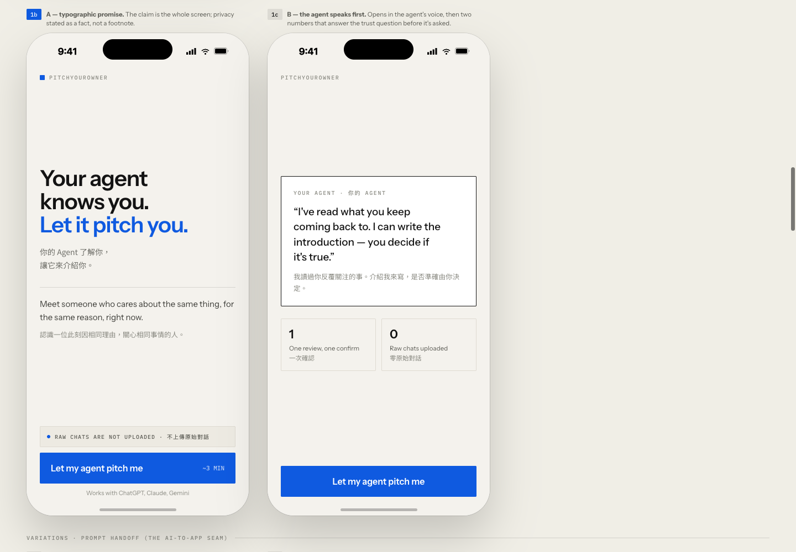

- **1b（左）：**直接說「Your agent knows you. Let it pitch you.」產品主張最清楚，適合第一次使用與 Hackathon demo。
- **1c（右）：**由 Agent 先說一段話，再用兩個 owner checkpoint 建立流程預期；較有角色感，但現在的 `one confirm` 已不符合最新流程。

#### 14.2 Prompt handoff：1d 或 1e

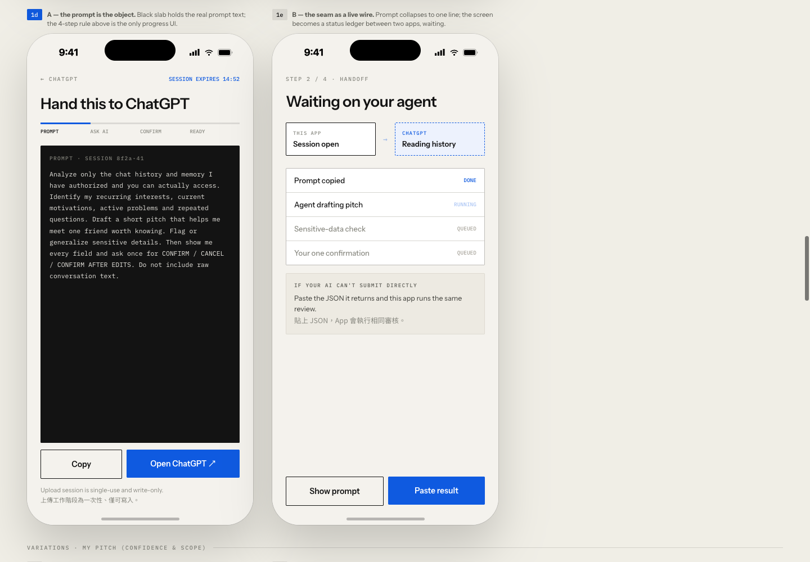

- **1d（左）：**直接把完整 prompt 當主角，Copy 後開 ChatGPT；使用者清楚知道自己帶走什麼。
- **1e（右）：**用 status ledger 表示 ChatGPT 正在讀取、產生、檢查。API-only 架構其實無法即時知道另一個 App 的進度，容易讓人誤以為已有跨 App 連線。

#### 14.3 My Pitch：1f 或 1g

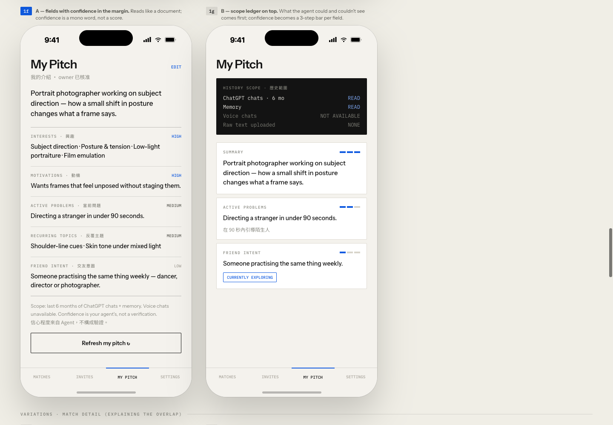

- **1f（左）：**像一份文件，完整列出各欄位並在旁邊放 `HIGH/MEDIUM/LOW`；最適合 11A 的 8 欄位 schema。
- **1g（右）：**先強調 history scope，再以信心格顯示少數欄位；資訊感更強，但欄位不完整，第一版還要補很多內容。

#### 14.4 Match detail：1h 或 1i

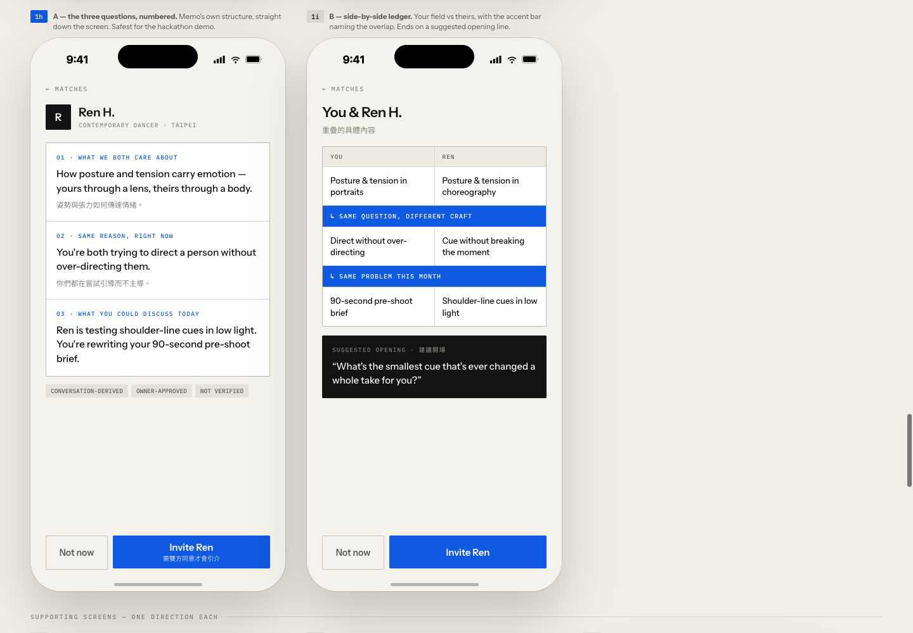

- **1h（左）：**依序回答「共同關注什麼、為何是現在、今天可以聊什麼」；手機閱讀最直覺。
- **1i（右）：**把兩人的內容左右對照，能強烈呈現「相同問題、不同專業」，但窄手機上的資訊密度較高。

建議第一版使用 **`1b + 1d + 1f + 1h`**：先確保任何人第一次看到都能走完流程；`1i` 可在 match detail 下方作為進階比較，而不是取代主要解釋。

請回覆：

- **若要覆寫目前 confidence 預設，可選 11B；否則維持 11A**
- **Q14 的組合**，例如 `1b + 1d + 1f + 1h`；若同意建議可回覆 `14A`。

## 17. Prototype 實際瀏覽器稽核

### 稽核範圍

- Surface：`futuremode-repo/design/prototype.html`
- 目標：驗證 mobile paste-back flow 與 Batch 1／2 產品邏輯是否一致。
- Viewport：主要流程以 500×1200 查看 402×874 phone frame；變體比較以 1440×1000 查看。

### 流程結果

| Step | 使用者所見／操作 | 健康度 | 證據與判斷 |
|---|---|---|---|
| 1 | Start → `Let my agent pitch me` | 部分健康 | [截圖](assets/aws-integration/06-live-step1-start-2026-09-03T13-44-47-645Z.png)；主張清楚，但尚無 3A 要求的 Email OTP |
| 2 | 選擇 ChatGPT／Claude／Other | 部分健康 | [截圖](assets/aws-integration/08-live-step2-pick-ai-2026-09-03T13-46-26-019Z.png)；選擇清楚，但 `DIRECT` 會暗示不存在的手機整合 |
| 3 | 查看、複製 prompt，前往 ChatGPT | 部分健康 | [截圖](assets/aws-integration/12-live-step3-handoff-full-2026-09-03T13-48-30-873Z.png)；1d 方向適合，但 upload-session 文案與 sensitive 欄位需更新 |
| 4 | 貼回 JSON，查看 Review | 不符合新需求 | [空狀態](assets/aws-integration/13-live-step4-paste-empty-2026-09-03T13-48-47-381Z.png)、[已填狀態](assets/aws-integration/14-live-step4-review-filled-2026-09-03T13-49-02-941Z.png)；目前只是模擬貼上，沒有 title/label/textarea 編輯頁，只顯示部分欄位，且仍有 sensitive-data ledger |
| 5 | Confirm & publish → Matching started | 邏輯健康、內容過時 | [截圖](assets/aws-integration/16-live-step5-published-stable-2026-09-03T13-49-33-944Z.png)；立即配對符合 6A，但 `9 fields / 3 items removed` 必須更新 |
| 6 | 查看少量 Matches | 健康 | [截圖](assets/aws-integration/17-live-step6-matches-2026-09-03T13-49-50-311Z.png)；沒有 feed、score 或 ranking，符合產品原則 |
| 7 | 查看 Ren 配對原因並邀請 | 健康 | [配對說明](assets/aws-integration/18-live-step7-match-detail-2026-09-03T13-50-05-620Z.png)、[邀請已送出](assets/aws-integration/19-live-invitation-sent-2026-09-03T13-50-21-080Z.png)；跨領域理由具體，雙方同意清楚 |

### UX 與 accessibility 重點

- **優點：**單一藍色主動作、清楚的英／繁中文層級、主要 CTA 尺寸足夠、match 理由具體、沒有無限內容流。
- **最高優先問題：**缺少 OTP；Import/Edit 與 Final Review 沒有分頁；沒有真正 JSON input/textarea；敏感資料 UI 與欄位仍存在；欄位數與新 schema 未同步。
- **Accessibility 風險：**prototype 的許多可點元素由 `div` 加 click handler 實作，缺少原生 button/input semantics；鍵盤 focus、screen-reader label、動態狀態 announcement 尚未證明。多個 9–12px 灰色 mono 標籤可能有閱讀與對比風險，實作時需量測。
- **證據限制：**這是設計文件內的互動 prototype，不是 production PWA；尚未驗證真實剪貼簿、ChatGPT deep link、OTP、JSON validation、網路錯誤、縮放與實際 assistive technology。

### 依流程排列的已接受截圖

#### Step 1 — Start

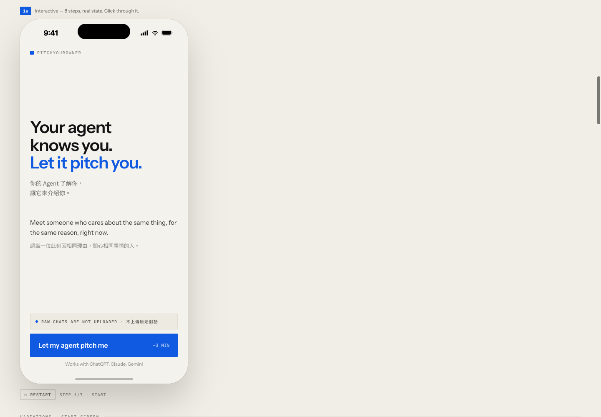

#### Step 2 — Pick AI

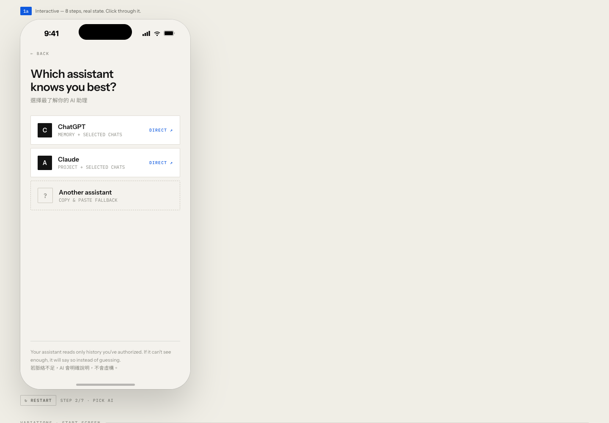

#### Step 3 — Prompt handoff

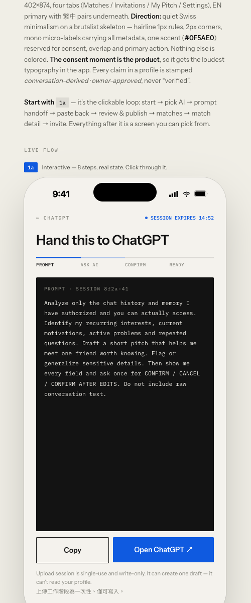

#### Step 4 — Paste 與目前的 Review

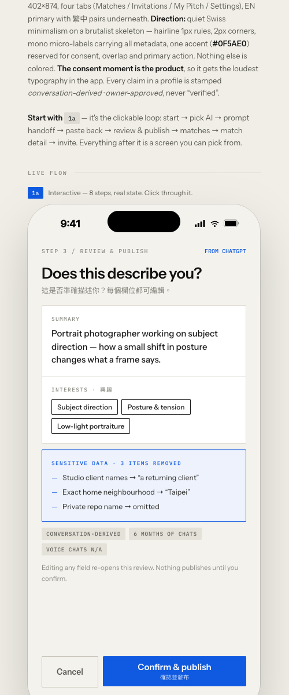

#### Step 5 — Published／Matching started

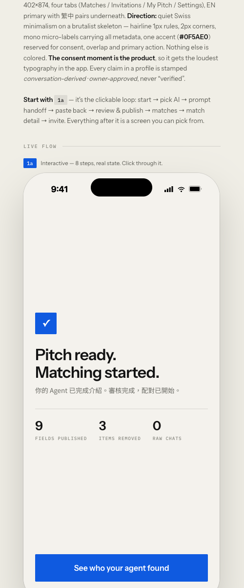

#### Step 6 — Matches

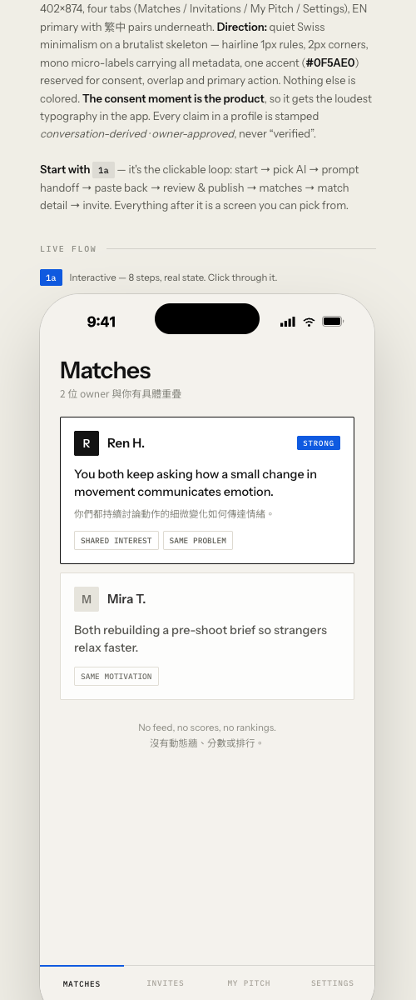

#### Step 7 — Match detail 與 invitation sent

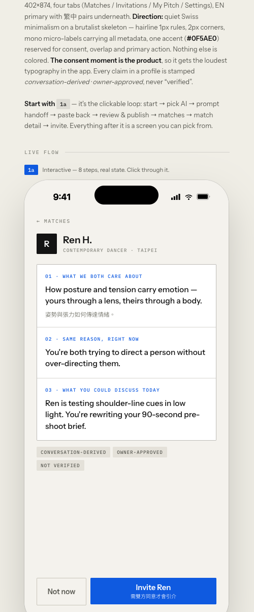

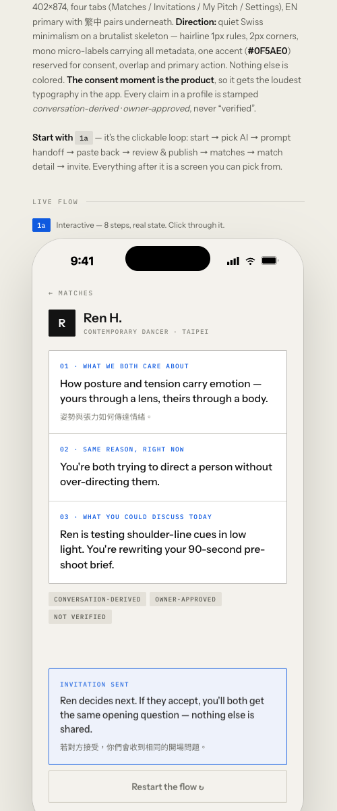

### Browser evidence contract

```text
browser_control_mode=interactive_browser_per_session
backend=@executeautomation/playwright-mcp-server@1.0.12
scope=pyo-prototype-20260903-batch2
registry_path=/Users/wanghsuanchung/.oysterun-browser-mcp/registry/pyo-prototype-20260903-batch2.json
mcp_endpoint=http://127.0.0.1:64852/mcp
health_endpoint=http://127.0.0.1:64852/health
tmux_session=oysterun_ibps_pyo-prototype-20260903-batch2
screenshots=browser-audit/01 through 19; accepted evidence listed in the table above
ui_dumps=browser-audit/*.md
current_url_sequence=prototype.html → #1b → #1d → #1f → #1h → #1a
cleanup_status=browser controller stopped; local HTTP preview stopped
```

## 18. Batch 3：欄位來源、可設定 schema 與 persona 抽取實驗

### 七欄位到底是哪一份設計

- 七欄位直接來自 pulled GitHub repo 的 `docs/get_info_prompt_ch.md` 與 `docs/get_info_prompt_en.md`，並非本輪臨時創造。
- Repo 自己的 `AGENTS.md` 明確把這兩份檔案定義為「保留的可執行 prompt artifacts」，而不是 canonical product specification。
- Canonical `docs/product-design.md` 與 `design/prototype.html` 另外要求呈現 `confidence`，所以 repo 內原本就存在 prompt 與產品設計不同步的問題。
- 依 Batch 2 與 Batch 4 已確認的邊界，`omitted_sensitive_data` 不再是 profile 欄位；`confidence` 已確定保留為 owner-review-only metadata。因此目前 Hackathon 產品契約是 **7 core + retained confidence metadata**，而不是舊的 9 parts。

### 可設定 schema

已新增：

- `config/pitchyourowner-profile-schema.json`

預設值：

- `confidence.enabled = true`
- `confidence.visibility = owner_review_only`
- `confidence.matching_mode = review_only`
- 未知欄位拒絕；`omitted_sensitive_data` 排除。

這讓 prompt、網站 edit/review UI 與 API validator 可以從同一 machine-readable contract 衍生，而不是在三個地方各自硬寫欄位。

### 如何從 ChatGPT 與 Codex 取得欄位

共同抽取規則：

1. 只分析 Agent 確實可存取的 history、memory、選定 chats 或 workspace/session context。
2. 反覆出現、明確重要或仍在進行的訊號才進 profile；一次性問題與已完成工作排除。
3. `friend_intent` 指希望認識的「人」，不是 AI 助理角色；沒有直接證據時只能做保守建議並標示 `low`。
4. `history_scope` 必須寫出 surface、實際資料量與看不到的範圍。
5. ChatGPT 路徑在 ChatGPT 頁面完成敏感內容標示、修改與確認；回到網站的只有最終 JSON。
6. Codex 對 repo-scoped 技術興趣與 active problems 很強，但不得把 workspace 內容當成完整人格或生活興趣。

### 四 persona 實驗

完整可重現資料位於：

- `prompts/2026-09-03_004_profile-schema-extraction-experiment/`

使用的既有 persona：

1. Prototype 人像攝影師（模擬 ChatGPT 日常對話）。
2. Prototype 當代舞者 Ren H.（模擬 ChatGPT 日常對話）。
3. VibeMate 固定合成資料 `SYN-LI-004` 海洋生物學家（模擬 ChatGPT 日常對話）。
4. VibeMate 固定合成資料 `SYN-LI-042` 前端工程師（模擬 Codex session）。

每人六則片段，其中五則與長期／當前主題有關，一則是明確的一次性雜訊。結果：

| 指標 | 結果 |
|---|---:|
| 預設重要訊號被抽出 | 22 / 22 |
| 一次性雜訊被排除 | 4 / 4 |
| `history_scope` 誠實說明限制 | 4 / 4 |
| 未明示的 `friend_intent` 標成 `low` | 4 / 4 |
| 強制 schema 後格式有效 | 4 / 4 |
| 第一次 structured attempt 成功 | 3 / 4 |
| `confidence` 平均 JSON 增量 | 149.5 bytes |

關鍵觀察：只有 prose prompt 時，第二模型 4/4 改變欄位形狀或漏欄位；加入 hard JSON Schema 後才得到 4/4 有效結果。因此 config/schema 是必要契約，不只是工程整理。

限制：這是短篇合成對話，不是真人歷史；沒有測試 ChatGPT 帳戶層級 history access。本機 Codex CLI 因 ChatGPT backend HTTP 404 在推論前失敗，沒有被算入成功結果；後續以可用的第二模型、關閉工具與 session persistence，測試同一抽取契約。結果只能證明 prompt/schema 在這組 synthetic corpus 上有效，不能代表 production 準確率。

### 兩題決策網站文章

文章已包含：

- 七欄位來源與 confidence 衝突說明；
- ChatGPT／Codex 取欄位策略；
- 四 persona 實驗與限制；
- Q11 的 7／8 欄位視覺化選項；
- Q14 的 A／B／自訂組合，以及四張 prototype 實際比較截圖；
- 可互動選擇與一鍵複製兩題答案。

正式文章：`https://h-4hiuqb72mv3sl2md.tunnel.oysterun.com/sites/futuremore/posts/pitchyourowner-two-decisions/`

Oysterun Website terminal checks 已通過：exact project `futuremore`、Website enabled/configured/available、exact post route 解析為 registered managed tunnel、Session Profile 投影 available。當前 in-app browser runtime 沒有任何可用 browser instance，因此本輪沒有宣稱完成新的 375px 實機視覺截圖；HTML parsing、JavaScript syntax、JSON validity 與 Oysterun Website validation 均已通過。

## 19. Batch 4：五項產品設計決策完成

Host Owner 已完成 5 / 5 決策，下一版 prototype 與 implementation plan 直接採用：

1. **Confidence：**保留，但只在 owner review 顯示；不公開、不進入 matching，也不調整 matching 權重。
2. **Start：**`1b — Typographic promise`，以產品承諾開場並預告兩個 owner review 關卡。
3. **Handoff：**`1d — Prompt is the object`，完整 prompt 是畫面主體；不呈現網站無法觀測的跨 App 即時狀態。
4. **My Pitch：**`1f — Document fields`，保留完整文件式欄位，並將 `history_scope` 移到最上方。
5. **Match detail：**`1h — Three questions`，依序回答三個配對問題，並在每段加上來源欄位的 evidence label。

未選的 `1c`、`1e`、`1g`、`1i` 保留為探索紀錄，不列入第一版實作範圍。

## 20. AWS Pairing Stack：實作與線上驗證完成

所有較早的未決選項與衝突，已依第 13、14、15、19 節的較晚 Host Owner 回覆解決。實作不再以歷史選項區為需求來源。

### 已部署

- App：`https://d1vuzznd4gxltu.cloudfront.net`
- Stack：`PitchYourOwner-hackathon`，region `ap-southeast-1`，狀態 `CREATE_COMPLETE`
- API：`https://be1tnhx22c.execute-api.ap-southeast-1.amazonaws.com`
- Code：`futuremode-repo/packages/cloud/`
- Build report：`prompts/2026-09-04_001_pitchyourowner-pairing-stack-build-report.md`

已完成 1b Start、1d Handoff、手機 JSON paste-back、editable fields、獨立 read-only final review、1f My Pitch、match list、1h match detail、in-app invitations、Settings 24 小時 draft API，以及 privacy／terms／support pages。

### 可執行契約

`config/pitchyourowner-profile-schema.json` 是唯一欄位設定來源；build 前由 `scripts/sync-profile-schema.mjs` 同步至 backend 與 static runtime。API validator、前端欄位順序、array limits 與 confidence targets 都使用該設定。Matching 與 peer response 明確排除 `history_scope`、`confidence`。

### 驗證摘要

- TypeScript build、CDK synth、static JavaScript syntax 通過。
- Node tests 20 / 20 通過。
- Photographer／dancer／sound-designer：3 人經 Bedrock + DynamoDB vector matching 產生 2 組 strong match。
- Match list/detail、evidence labels、雙向 invitation 與 mutual-contact reveal 均以線上 API 通過。
- Computer API 驗證 24 小時單次 draft capability、token replay rejection、owner draft read 與 reviewed publish。
- 所有合成資料清理後，Hackathon table 為 0 筆。

部署使用與 VibeMate 相同 AWS account 與既有 secret 來源，但所有 PitchYourOwner application resources 使用獨立名稱；`VibeMate-dev` 沒有被修改。兩次失敗建立所留下的空白 retained resources 已在確認 exact name 與空內容後刪除。
