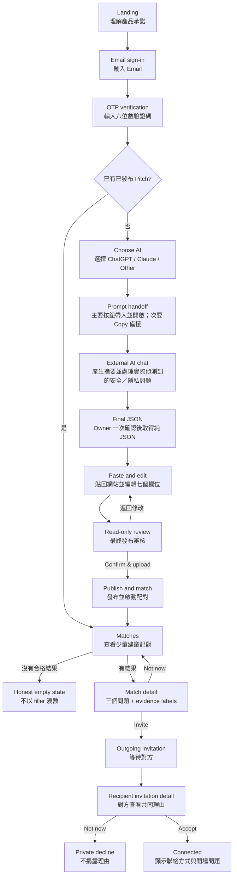

# PitchYourOwner — Customer Flow and Page Inventory｜顧客流程與頁面清單

_Planning view derived from the canonical product design · updated 2026-09-04_

本文件供 PM、流程設計師與工程師共同確認「使用者從登入到完成配對」所經過的決策、
頁面與狀態。它是 [`Product Design`](../product-design.md) 的流程／頁面索引；若兩者衝突，
以 Product Design 與 [`Project and Hackathon Guide`](project-and-hackathon-guide.md) 的較新決定為準。

## 1. What “matched” means｜「配對完成」的定義

PitchYourOwner 有三個不同結果，不應都寫成 **matched**：

| State｜狀態 | Meaning｜意義 | Contact visible?｜可見聯絡方式？ |
| --- | --- | --- |
| **Suggested match｜建議配對** | 系統找到能具體解釋的共同興趣、動機、問題或反覆主題 | 否 |
| **Invited｜已邀請** | 其中一位 owner 已表示想認識對方，等待另一方決定 | 否 |
| **Connected｜已連結** | 雙方都接受，正式完成引介 | 是 |

本流程以 **Connected／雙方接受** 作為完成點。Hackathon 核心技術展示至少要到 Suggested
match；完整產品展示則應走到 Connected。

## 2. End-to-end customer flow｜端到端顧客流程

### Phase A — Authentication｜登入

1. 使用者從 Landing 點擊 **Let my agent pitch me**。
2. 輸入 Email，網站寄送一次性六位數 OTP。
3. 使用者輸入 OTP；成功後網站建立 owner session。這同時完成註冊與登入，不另設密碼。
4. Returning owner 應依狀態導向：
   - 已有 active pitch → `Matches`；
   - 有未完成 draft → 回到最後一個安全的 draft／review 狀態；
   - 尚無 pitch → `Choose AI`。

### Phase B — Let the agent prepare the pitch｜由 Agent 準備 Pitch

5. 使用者選擇平常最了解自己的 ChatGPT、Claude 或 Other AI。
6. 網站顯示完整 prompt 作為主要物件。ChatGPT 使用 **Open ChatGPT with my prompt**
   主要操作，將完整 prompt 預填後開啟 ChatGPT，並嘗試複製至剪貼簿備援；另保留可見的
   **Copy prompt** 次要操作處理過長 URL、權限或 in-app browser 失敗，但不要求先 Copy、
   再 Open。其他 AI 在支援時採相同主要交接與 Copy fallback。
7. 使用者在外部 AI 對話貼上 prompt。AI 只使用 owner 授權且實際可存取的 context：
   - 先產生精簡整體摘要，不要求逐欄核對 profile；
   - 只列出實際偵測到的 security／privacy 問題；
   - 每個問題使用 `S1`、`S2`…、說明具體風險並提供可直接選擇的處理方式；
   - 不詢問「這是否符合你的聊天歷史」或其他一般／開放式 profile 問題；
   - owner 在一則訊息處理全部項目並加入
     **確認安全並產生 JSON／CONFIRM SECURITY AND GENERATE JSON**；
   - 下一則回覆只能是一個可解析的 profile JSON，沒有 prose 或 Markdown code fence。

外部 AI 對話是流程的一部分，但不是 PitchYourOwner 擁有或能觀測的頁面。網站不能顯示
「AI 正在分析」之類無法驗證的即時狀態。

### Phase C — Import, edit, and publish｜匯入、編輯與發布

8. 使用者回到網站，貼上 AI 最後產生的 JSON。
9. 網站只進行 schema／格式驗證；不再偵測、過濾、標記或改寫敏感資料。
10. 驗證成功後，網站渲染七個可編輯 profile 欄位，`history_scope` 置頂；`confidence`
    只作 owner review metadata，不公開且不參與 matching。
11. **Continue to review** 開啟獨立唯讀頁。**Back to edit** 必須保留修改；只有
    **Confirm & upload** 能發布。
12. 發布成功後建立 profile version，立即啟動 matching，再前往 Matches。

### Phase D — Discover and understand a match｜發現並理解配對

13. Matches 只顯示少量有具體理由的建議；沒有合格配對時顯示誠實的 empty state。
14. Match Detail 必須回答：
    1. 雙方共同關心什麼？
    2. 為什麼這件事此刻對雙方都重要？
    3. 現在可以聊什麼？
15. 每個答案標示支持它的 profile evidence field，但不顯示 numeric match score、
    confidence、人氣或 follower 訊號。

### Phase E — Mutual invitation and connection｜雙方邀請與連結

16. Owner 選擇 **Invite** 或 **Not now**。Not now 的理由不提供給對方，也應阻止立即重邀。
17. 收件者從 general notification 或 Invitations 進入同一份 Match Detail，再選擇
    **Accept** 或 **Not now**。
18. 只有雙方都接受後，狀態才變成 Connected，並顯示聯絡方式與建議的開場問題。
    同時邀請應收斂成同一筆 Connected 關係。

## 3. Core information architecture｜核心資訊架構

登入後的常駐導覽維持四區；建立 pitch 的 onboarding 是暫時流程，不增加第五個 tab。

| Area｜區域 | User question｜使用者問題 |
| --- | --- |
| **Matches** | 現在有誰值得我認識？理由是什麼？ |
| **Invites** | 哪些邀請正在等我、等對方，或已完成連結？ |
| **My Pitch** | 我的 Agent 正在如何介紹我？ |
| **Settings** | 如何控制帳號、matching、通知、資料與安全？ |

## 4. Hackathon page inventory｜Hackathon 頁面清單

「Page」指一個清楚的使用者任務；多個 page state 可以共用同一個 route。這樣可以完整
設計流程，又不必為每個成功訊息或 loading 狀態建立獨立 URL。

| ID | Page / state｜頁面／狀態 | Current route｜目前 Route | Main job｜主要任務 | Priority | Current implementation｜目前實作 |
| --- | --- | --- | --- | --- | --- |
| P01 | Landing｜開始頁 | `/` | 理解承諾、約需時間與兩個確認關卡 | P0 | 已有 |
| P02 | Email sign-in｜Email 登入 | `/signin` | 輸入 Email 並要求 OTP | P0 | 已有 |
| P03 | OTP verification｜驗證碼 | `/signin` 的第二狀態 | 完成無密碼登入；可改 Email／重送 | P0 | 基本流程已有；明確重送與倒數尚需補齊 |
| P04 | Choose AI｜選擇 AI | `/assistant` | 選擇最了解 owner 的 AI 與 prompt 語言 | P0 | 已有；繁體中文／English |
| P05 | Prompt handoff｜Prompt 交接 | `/handoff` | 檢視 prompt、主要按鈕帶入並開啟 AI、Copy fallback、返回匯入 | P0 | 已有；handoff state 可跨 reload 復原；ChatGPT 採預填 deep link |
| X01 | External AI chat｜外部 AI 對話 | ChatGPT／Claude／其他 AI | 產生 pitch、只處理 security／privacy 決定並輸出純 JSON | P0 | 不屬本站；中英文 canonical prompts 已有 |
| P06 | Paste JSON｜貼回 JSON | `/import` 空白狀態 | 貼上最終 JSON 並得到精確錯誤 | P0 | 已有 |
| P07 | Edit pitch｜編輯 Pitch | `/import` draft 狀態 | 編輯全部欄位與 owner-only confidence | P0 | 已有 |
| P08 | Final publish review｜最終發布審核 | `/review` | 唯讀確認網站將儲存的完整版本並輸入 display name | P0 | 已有；display name 不屬於 Agent-derived profile |
| P09 | Publish／matching progress｜發布／配對中 | P08 → `/matches` transition | 告知發布成功、matching 已開始、失敗可重試 | P0 | 有基本 loading／notice；需補 interrupted recovery |
| P10 | Matches list｜配對列表 | `/matches` | 查看少量建議配對 | P0 | 已有 loading、empty、list |
| P11 | Match detail｜配對詳情 | `/matches/:matchId` | 回答三個配對問題、顯示 evidence labels | P0 | 已有 |
| P12 | Invitation status｜邀請狀態 | `/matches/:matchId` 狀態 | Invite、Not now、等待對方 | P0 | 已有 |
| P13 | Invitations hub｜邀請中心 | `/invitations` | 查看 incoming、outgoing、connected | P0 | 已有 |
| P14 | Connected detail｜已連結詳情 | `/matches/:matchId` connected 狀態 | 顯示聯絡方式與開場問題 | P0 | 已顯示聯絡方式；開場問題呈現在配對說明中 |
| P15 | My Pitch｜我的介紹 | `/pitch` | 查看已發布 pitch、scope、來源標籤與重新產生入口 | P0 | 已有；不顯示 review-only confidence |
| P16 | Settings｜設定 | `/settings` | 管理 matching、account、Computer API 與資料 | P0 | 部分完成 |
| P17 | Privacy｜隱私說明 | `/privacy` | 說明 AI 與網站的資料責任邊界 | P0 | 只有短版 placeholder |
| P18 | Terms｜使用條款 | `/terms` | 說明 pitch 是 owner-approved inference，不是身分／專業證明 | P0 | 只有短版 placeholder |
| P19 | Support｜支援 | `/support` | 送出 message 與 optional contact，不含 profile payload | P0 | 已接 `POST /v1/support-requests` 並顯示 request ID |

目前前端共有 **14 個 route pattern**；因 `/signin`、`/import` 與 `/matches/:matchId` 各承載多個
任務狀態，完整核心體驗為上表 **19 個站內 page/state + 1 個外部 AI surface**。

## 5. Pages and controls needed after the core demo｜核心 Demo 後仍需的頁面與控制

以下需求已出現在 canonical design，但目前 UI 尚未完整提供。可先放在 Settings 的子頁，
不必擴充底部導覽。

| ID | Page / control｜頁面／控制 | Why it is needed｜需要原因 | Priority / status｜優先度／狀態 |
| --- | --- | --- | --- |
| C01 | Account identity｜帳號識別 | Owner 在 final review 提供 1–40 字元 display name／handle；這是 publish metadata，不加入七個 agent-derived profile 維度。 | **P0；已實作** |
| C02 | Matching visibility｜配對可見性 | Owner 需能暫停／恢復 matching，並理解對既有 matches 的影響。 | **P0；API 已支援 active／paused，UI 未接** |
| C03 | Notification preference｜通知設定 | 管理 strong-match 與 invitation 通知；lock-screen copy 維持概括，點擊後 deep-link 到 authenticated detail。 | **P1；未完成 end-to-end** |
| C04 | Blocked owners｜封鎖名單 | 避免不受歡迎的再次接觸，並提供解除封鎖入口。 | **P1；未實作** |
| C05 | Report flow｜檢舉流程 | 從 Match Detail／Connected Detail 送出具體 reason，且不公開給被檢舉者。 | **P1；未實作** |
| C06 | Data export｜資料匯出 | 讓 owner 取得已儲存 pitch、version 與 invitation decisions。 | **P1；未實作** |
| C07 | Delete confirmation｜刪除確認 | 在刪除前明確列出 pitch、matches、invites 與 session 的影響。 | **P0；目前只有 browser confirm** |
| C08 | Computer API detail｜Computer API 詳情 | 建立並說明 24 小時、single-use、write-only、draft-only upload session；POST 後以 Resume computer draft 回到 edit／final review。 | **P1；完整 round-trip 已實作** |
| C09 | Connection feedback｜引介後回饋 | 回答是否真的開始對話、是否有用、若無 PitchYourOwner 是否會找到此人，支援 Hackathon validation。 | **P1 for experiment；未實作** |

不需要為 loading、copy success、invite sent、Not now、delete confirmation 建立新的頂層頁面；
它們應是原任務中的 inline state、dialog 或 bottom sheet，並且要有明確的 success、error、
retry 與 offline/interrupted 狀態。

## 6. Returning-user and recovery flows｜回訪與復原流程

| Situation｜情況 | Expected destination / recovery｜預期去向／復原方式 |
| --- | --- |
| 已登入且有 active pitch | 直接進 Matches，而不是重新選 AI |
| 已登入但無 pitch | 進 Choose AI |
| 本機有未發布 draft | 提示 Resume draft 或 Start over；不得靜默覆蓋 |
| Session expired during edit | 重新驗證後回到保留的 draft，不得發布任何內容 |
| AI context insufficient | 在 AI 端誠實說明；允許 owner 提供 selected chats／export，不虛構 profile |
| 貼入非 JSON／preview | 保留輸入，指出這不是 final JSON，提供返回 AI 的具體指示 |
| JSON schema 不合 | 指出缺少、未知、重複或超長欄位；不得部分發布 |
| Publish failed | draft 與 owner edits 全部保留，讓使用者重試 |
| Matching still running | 說明狀態並提供 Check again；不顯示假結果 |
| No viable matches | 誠實 empty state；不加入 filler profile |
| Match／invitation expired | 說明已過期並回到目前可用 matches |
| Notification deep link while signed out | 登入後回到原本的 match／invitation detail |
| Not now | 對方只看到不再 pending，不看到私人理由；限制立即重邀 |
| Pitch deleted | 從未來與既有 match surfaces 移除，完成後回到 signed-out／start state |

## 7. Navigation and state rules｜導覽與狀態規則

- Onboarding 頁不顯示底部導覽，避免把 owner 帶離未完成的 publish flow；但必須能安全離開
  並在回來時 resume。
- 發布後才顯示 `Matches / Invites / My Pitch / Settings` 四個底部 tab。
- Notification 不另建 inbox tab；strong match deep-links 到 Match Detail，invitation deep-links
  到 incoming Match Detail。Invitations hub 是站內狀態總覽。
- My Pitch 的重新產生會建立新 draft；舊 published version 在新版本確認前維持 active。
- `history_scope` 與 `confidence` 永遠不出現在對方的 Match Detail。公開／matchable profile
  只包含 owner 已發布且允許分享的核心內容。
- 不建立 browse-all profiles、swipe feed、leaderboard、followers、public score 或站內聊天頁。
  連結後的對話使用雙方同意揭露的聯絡方式完成。

## 8. Important implementation gaps and unresolved decisions｜重要缺口與待決定事項

1. **Returning-owner redirect（已解決）：**OTP 成功後先取得 profile；有已發布 pitch 前往
   Matches，只有 local draft 時回 Import，否則才進 Choose AI。
2. **Display identity（已解決）：**display name 是 publish payload 的獨立欄位，不由 Agent
   推論，也不從 Email local-part 暗自產生；owner 在 final review 輸入 1–40 字元名稱或 handle。
3. **Confidence visibility（已解決）：**confidence 僅出現在 edit／final review，不出現在
   My Pitch、matching、peer response 或公開畫面。
4. **Handoff expiry boundary（已解決）：**24 小時只適用於 Computer API upload token；手機
   handoff 不再顯示不存在的 expiry，且 prompt、AI、locale 可跨 hard reload 復原。
5. **Safety readiness：**block、report、invitation rate limit 與 age policy 在公開服務前不可缺；
   Hackathon 若只允許已知成人參與者，應將此 cohort 限制明確寫入測試計畫。
6. **Notifications：**產品已定義 strong-match／invitation 通知，但目前尚無完整裝置權限、
   preference、general lock-screen copy 與 authenticated deep-link 流程。
7. **Legal and support：**Support 已可提交 message 與 optional contact；Privacy、Terms 仍是
   短版 placeholder，公開招募外部使用者前需要正式內容。
8. **Experiment completion：**若 Hackathon 目標包含驗證相關性，Connection 後需要最小回饋
   surface，否則只能量到 click／accept，無法量到是否真的開始有用的對話。

## 9. Recommended delivery order｜建議交付順序

1. 修正 returning-owner routing、draft resume 與 publish failure recovery。
2. 決定 display identity 與 confidence 顯示邊界，完成 P01–P19 的一致文案。
3. 完成 Match Detail → Invite → recipient Accept → Connected 的雙人真實流程。
4. 補上 matching pause、delete consequence、block／report 與 invitation rate limits。
5. 完成 notification deep links 與 Connection feedback，再進行跨 persona Hackathon 測試。

這個順序優先確保「登入 → agent pitch → owner 發布 → 可解釋配對 → 雙方連結」真的能在
兩支手機上完成；不以增加頁數或瀏覽時間作為成功標準。
