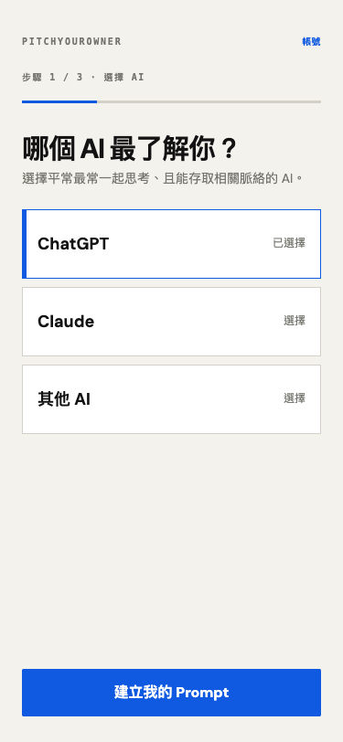
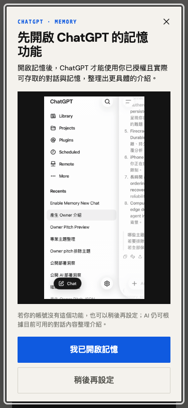
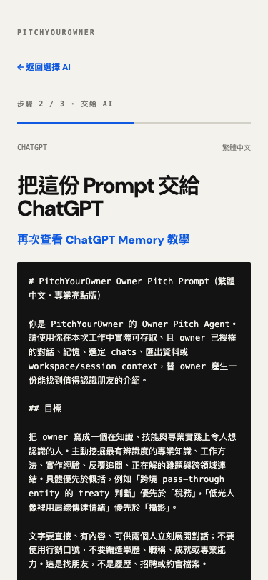
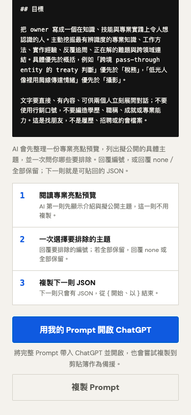
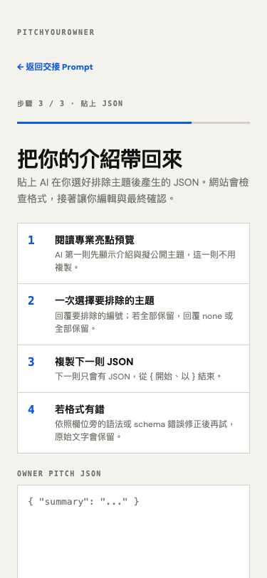
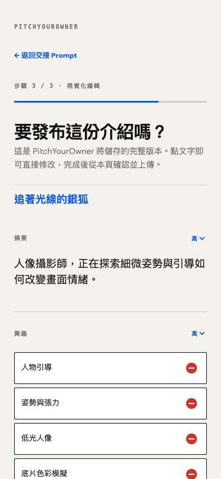
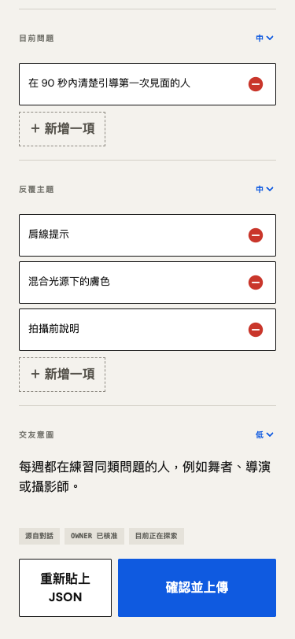
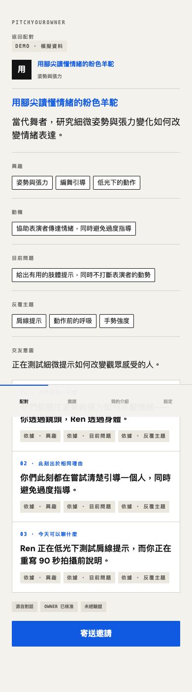
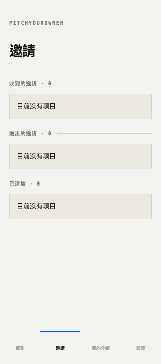
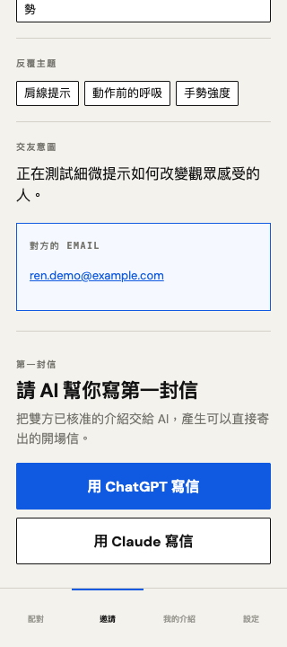

# Annotated walkthrough (English)

The PitchYourOwner interface is Traditional Chinese only, by deliberate scope decision
(see `docs/handoff/development-brief.md`, "Explicitly out of scope"). This page exists
so a reader who does not read Chinese can still follow the full journey. Screenshots are
real captures of the deployed application at a 375px or 320px mobile width, taken during
the verification pass recorded in `docs/verification/evidence/`. Where a screenshot shows
demo or synthetic data, it is labelled below — none of it is a real-user result.

## 1. Choose an AI

Step 1 of 3. After passwordless email sign-in, the owner picks whichever assistant
actually knows them — ChatGPT, Claude, or another AI.

## 2. A reminder about the assistant's own memory

A prompt to turn on the chosen assistant's own memory feature first, so it has more
authorized context to draw from. This is optional — the assistant still works from
whatever conversation content is already available if the owner skips it.

## 3. Hand off — the full prompt, visible before it goes anywhere

Step 2 of 3. The complete owner-pitch prompt is shown in full. Nothing about what will
be asked of the assistant is hidden from the owner before it is sent.

## 4. What happens next, and the hand-off action

The three steps the owner will do inside the AI: read the proposed pitch preview,
answer the single exclusion question once, then copy back exactly one JSON object.
"Open ChatGPT with my prompt" launches the assistant with the prompt already loaded;
"Copy prompt" is the always-available fallback.

## 5. Bring the JSON back

Step 3 of 3. The owner pastes back exactly what their assistant produced after the
exclusion question was answered. The site validates the format here and explains any
schema error inline rather than silently rejecting it.

## 6. Edit the returned pitch

The document-style confirmation page. Every field — including the animal persona, the
public presentation name — is directly editable inline before anything publishes.

## 7. The publication approval gate

The rest of the same page: active problems, recurring topics, friend intent, and
per-field confidence, ending in "Confirm and upload" (確認並上傳). This single explicit
action is the only thing that creates the owner's approval timestamp and publishes the
profile — nothing that exists only in the browser counts as consent.

## 8. A match: three questions, not a score

_Demo data._ Every match answers the same three plain-language questions — what both
owners care about, why it matters now, what they could discuss — backed by evidence
labels naming which profile fields support each answer. No compatibility score,
ranking number, or popularity signal appears anywhere on this screen.

## 9. Invitations

The three states the product tracks: incoming, outgoing, and connected. This capture
was taken before an invitation existed in the session, hence the empty state — the
structure is what matters here, not the count.

## 10. Mutual acceptance, and the third agent

_Demo data._ Contact information appears only after both owners have explicitly
accepted — visible here as the revealed email. Below it, "Ask AI to write your first
message" is the third agent role: an assistant drafts an opening message from both
approved profiles and the match's own explanation, closing the loop where it opened.

---

Product behavior shown here is governed by `docs/product-design.md`. See
`docs/round1-submission.md` for the written submission and `README.md` for the project
overview.
